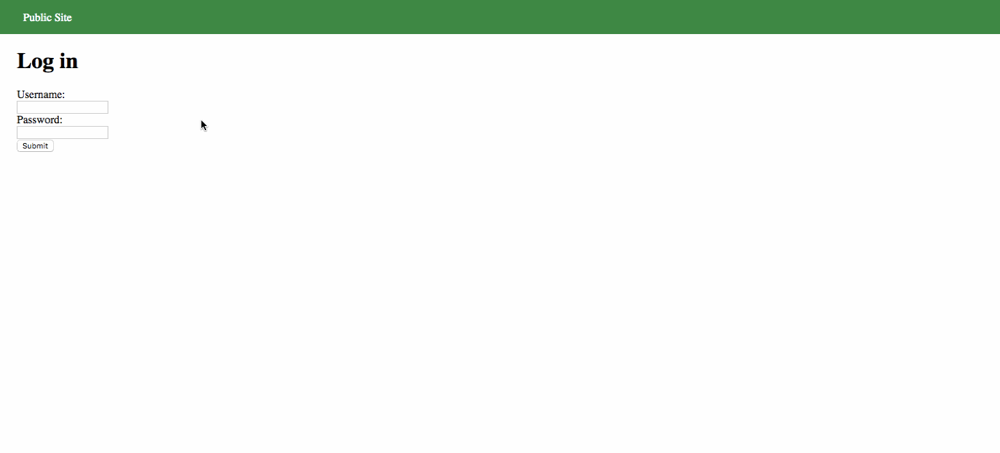

# Project 8 - Pentesting Live Targets

Time spent: 5 hours spent in total

> Objective: Identify vulnerabilities in three different versions of the Globitek website: blue, green, and red.

The six possible exploits are:
* Username Enumeration
* Insecure Direct Object Reference (IDOR)
* SQL Injection (SQLi)
* Cross-Site Scripting (XSS)
* Cross-Site Request Forgery (CSRF)
* Session Hijacking/Fixation

Each version of the site has been given two of the six vulnerabilities. (In other words, all six of the exploits should be assignable to one of the sites.)

## Blue

Vulnerability #1: __________________

Vulnerability #2: __________________

## Green

Vulnerability #1: Username Enumeration

Username enumeration is possible on this website due to the developer making the text bold when a valid username is entered. This is a poor programming choice because an experienced hacker is looking for ANY difference at all in responses received from the server during the enumeration process.

Vulnerability #2: Cross-Site Scripting (XSS)

## Red

Vulnerability #1: __________________

Vulnerability #2: __________________

## Notes

This one was better because I didn't need to use Kali Linux to complete the assignment. I have an older laptop with 4GB of RAM and a 4th generation i5. I was able to use sqlmap on my Mac, and that was the only "hacker tool" I needed.
