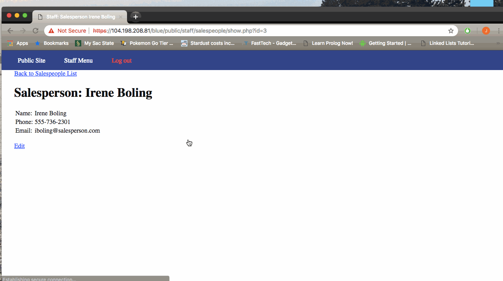

# Project 8 - Pentesting Live Targets

Time spent: 5 hours spent in total

> Objective: Identify vulnerabilities in three different versions of the Globitek website: blue, green, and red.

The six possible exploits are:
* Username Enumeration
* Insecure Direct Object Reference (IDOR)
* SQL Injection (SQLi)
* Cross-Site Scripting (XSS)
* Cross-Site Request Forgery (CSRF)
* Session Hijacking/Fixation

Each version of the site has been given two of the six vulnerabilities. (In other words, all six of the exploits should be assignable to one of the sites.)

## Blue

Vulnerability #1: Session Hijacking

Web Browsers: Chrome Version 70.0.3538.102 and Safari 12.0.1

To complete this challenge, I logged in to the blue website in Chrome using the pperson account. Once logged in, I went to https://104.198.208.81/blue/public/hacktools/change_session_id.php and used this tool to copy my session ID. I then launched Safari and went to the blue website login page. I went to the change_session_id.php page and pasted the session ID from the Google Chrome session. I then went back to the blue login page in Safari, clicked Public, and was brought into the portal as if I am the user pperson.

Vulnerability #2: SQL Injection

The salesperson page was vulnerable because in the URL there is the id parameter, which when passed a single quote, returns "Database query failed.". That tells me it is susceptible to an SQL Injection attack.  Example: https://104.198.208.81/blue/public/staff/salespeople/show.php?id' OR SLEEP(100)=0--'

I went ahead and did a capture of the denail of service attack above. If a database accepted this command, an attack could render it useless until the problem was resolved. 

## Green

Vulnerability #1: Username Enumeration

Username enumeration is possible on this website due to the developer making the text bold when a valid username is entered. This is a poor programming choice because an experienced hacker is looking for ANY difference at all in responses received from the server during the enumeration process.  

Vulnerability #2: Cross-Site Scripting (XSS)

This one was pretty straight forward. Any person is able to submit a script via the Feedback form. I submitted a simple script of . After the form was submitted, I logged into the website as a user with priviledges to access the Feedback page.

## Red

Vulnerability #1: __________________

Vulnerability #2: __________________

## Notes

This one was better because I didn't need to use Kali Linux to complete the assignment. I have an older laptop with 4GB of RAM and a 4th generation i5. I was able to use sqlmap on my Mac, and that was the only "hacker tool" I needed.

